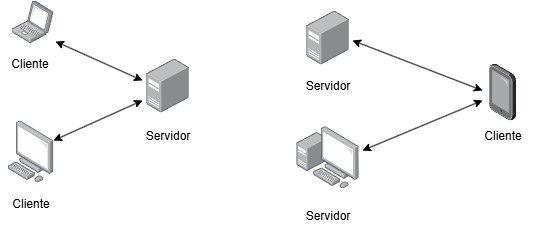

# Práctica 1

| Documento: | Módulo-1: Arquitectura cliente-servidor                                                              |
| ---------- | ---------------------------------------------------------------------------------------------------- |
| Curso:     | SISTEMAS DISTRIBUIDOS - Grado en Ingeniería Informática                                              |
| Libro:     | Enunciado 1: Introducción a los sistemas distribuidos. Arquitectura de distribución cliente-servidor |
| Autor:     | SAYALERO BLAZQUEZ, ALONSO                                                                            |
| Fecha:     | viernes, 19 de septiembre de 2025                                                                    |
| Versión:   | 0.1                                                                                                  |

## Introducción

??

## Tabla de contenidos

- [Introducción](#introducci%C3%B3n)
- [Tabla de contenidos](#tabla-de-contenidos)
- [La arquitectura de distribución cliente-servidor](#la-arquitectura-de-distribuci%C3%B3n-cliente-servidor)
- [JSON-RPC](#json-rpc)
- [Poner la teoría en práctica](#poner-la-teor%C3%ADa-en-pr%C3%A1ctica)
  - [El cliente Java](#el-cliente-java)
    - [Petición con parámetros](#petici%C3%B3n-con-par%C3%A1metros)
    - [La función "printServerResult"](#la-funci%C3%B3n-printserverresult)
  - [Poniéndolo en práctica](#poni%C3%A9ndolo-en-pr%C3%A1ctica)

## La arquitectura de distribución cliente-servidor

En el contexto de los sistemas distribuidos, un sistema construido en base a una arquitectura cliente-servidor consta de dos elementos, bien nombrados en el propio nombre de la arquitectura, el cliente y el servidor. Hay que tener en cuenta que esto abarca cualquier multiplicidad de los elementos, un sistema con arquitectura cliente-servidor puede estar formado por un cliente y un servidor o dos clientes y un servidor o un cliente y tres servidores, y así con todas las combinaciones posibles dependiendo de las necesidades globale del sistema.

El servidor es la máquina o máquinas físicas o virtuales cuyo trabajo es recibir peticiones a través de un punto de acceso. La comunicación con el punto de acceso proporcionado por el servidor se realiza mediante uno o varios protocolos de transporte, los más conocidos son TCP (sobre el que se construye HTTP) y UDP.

Al igual que el servidor el cliente puede ser también una máquina física o virtual o varias de ellas. Su trabajo es realizar peticiones al servidor que provocan una respuesta del mismo, estas respuestas pueden incluir una gran variedad de tipos, entre ellos respuestas de éxito, de rechazo o de error.



La imagen superior muestra un par de ejemplos de arquitecturas distribuidas cliente-servidor. Se puede observar como tanto los clientes como los servidores pueden ser cualquier tipo de dispositivo con las capacidad necesarias.

## JSON-RPC

JSON-RPC es un protocolo de llamada de procedimientos remotos (RPC, remote procedure call). Normalmente los protocolos que implementan RPC utilizan estructuras de datos codificadas de manera que la salida de las mismas son binarios no legibles para el ser humano. JSON-RPC trata evita esto empleando la estructura de JSON como método de codificación para los mensajes entre cliente y servidor.

Durante esta y las siguientes lecciones estaremos trabajando con peticiones por parte del cliente y respuestas por parte del servidor. El estándar del protocolo define como debe ser la estructura de los objetos petición y respuesta con los que trabajaremos.

Ambos objetos constan de un campo de versión, necesario en este caso ya que estaremos trabajando con la versión 2 de este protocolo.

El objeto petición consta de un campo método (method) obligatorio en el que se indica el método que se quiere invocar en el servidor, un campo parámetros (params) opcional en el que se pasan elementos necesarios para el método invocado, el equivalente a los parámetros de una función en programación, y un campo identificador (id) el cual nosotros tomaremos como obligatorio y que, también en nuestro caso, será un string.

```json
{
  "version": "2.0",
  "method": "travel",
  "params": {
    "location": "madrid",
    "days": 3
  },
  "id": "100"
}
```

El código JSON de arriba muestra un ejemplo de petición con parámetros.

El objeto respuesta por su parte consta de un campo resultado (result) si la petición ha sido correcta o, si la petición es incorrecta, un campo error con los motivos del mismo. Además devuelve el mismo identificador (id) que había recibido del objeto petición.

```json
{
  "version": "2.0",
  "result": "resultado de la accion",
  "id": "100"
}
```

El código JSON de arriba muestra un ejemplo de respuesta a una petición sin errores.

Para profundizar sobre lo que se ha resumido arriba la especificación del mismo es corta y asequible y se puede encontrar en el siguiente enlace: https://www.jsonrpc.org/specification (inglés).

## Poner la teoría en práctica

Una vez entendidos los conceptos vamos a ponerlos en práctica. Durante las siguientes prácticas vamos a pasarnos un juego escrito en Elixir y que va a actuar como servidor (o servidores como veremos en prácticas posteriores).

En prácticas posteriores nos adentraremos en su funcionamiento pero, de momento, vamos a enfocarnos en como jugar. Al actuar como un servidor vamos a necesitar un cliente (o clientes) que se comuniquen con él y nos permitan avanzar por el juego. Para esta labor vamos a escribir un cliente Java.

### El cliente Java

Sabiendo que el servidor acepta peticiones TCP/IP y que funciona mediante el protocolo JSON-RPC podemos hacer un cliente en Java que se conecte al puerto 3000 por el que está escuchando el juego y lanzar una petición para saber todos los métodos que acepta el servidor.

```java
public class JavaClient {
  public static void main(String[] args) throws IOException {
    Gson jsonParser = new Gson();
    Socket socket = new Socket("localhost", 3000);

    PrintWriter out = new PrintWriter(socket.getOutputStream(), true);
    BufferedReader in = new BufferedReader(new InputStreamReader(socket.getInputStream()));

    HashMap<String, Object> mapa = new HashMap<String, Object>();
    mapa.put("jsonrpc", "2.0");
    mapa.put("method", "info");
    mapa.put("id", "1");

    out.println(jsonParser.toJson(mapa));

    HashMap<String, Object> respuesta = jsonParser.fromJson(in.readLine(), new TypeToken<HashMap<String, Object>>() {}.getType());

    printServerResult(respuesta);
    socket.close();
  }

  private static void printServerResult(HashMap<String, Object> mapa) {
    Object resultado = mapa.get("result");
    Object error = mapa.get("error");

    if (resultado == null) {
      if (error == null) {
        System.out.println("Algo salio mal en el servidor");
      } else {
        System.out.println("Error al realizar la accion: " + error);
      }
    } else {
      System.out.println(resultado);
    }
  }
}
```

Vamos a desgranar que es lo que estamos haciendo en el código de arriba.

En primer lugar creamos un parser para transformar mapas de Java en JSON y viceversa.

```java
Gson jsonParser = new Gson();
```

A continuación creamos un socket que nos conecta con el servidor mediante el puerto 3000 y también inicializamos el escritor y el lector del socket. El escritor nos permite mandar la petición al juego mientras que el lector atrapa la respuesta que este nos dé.

```java
Socket socket = new Socket("localhost", 3000);

PrintWriter out = new PrintWriter(socket.getOutputStream(), true);
BufferedReader in = new BufferedReader(new InputStreamReader(socket.getInputStream()));
```

Una vez tenemos el socket conectado el siguiente paso natural es realizar la petición, para ello tenemos que contruirla en un mapa de Java y dárselo al parser de JSON para que nos lo transforme y lo podamos enviar.

```java
HashMap<String, Object> mapa = new HashMap<String, Object>();
mapa.put("jsonrpc", "2.0");
mapa.put("method", "info");
mapa.put("id", "1");

out.println(jsonParser.toJson(mapa));
```

Por último, obtenemos la respuesta del servidor, la imprimimos en consola y cerramos el socket.

```java
HashMap<String, Object> respuesta = jsonParser.fromJson(in.readLine(), new TypeToken<HashMap<String, Object>>() {}.getType());

printServerResult(respuesta);
socket.close();
```

#### Petición con parámetros

Si queremos mandar parámetros al juego como parte de la petición simplemente habría que incluir el campo en el mapa de Java que hemos creado para la petición.

```java
// Petición anterior
HashMap<String, Object> mapa = new HashMap<String, Object>();
mapa.put("jsonrpc", "2.0");
mapa.put("method", "info");
mapa.put("id", "1");

// HashMap de parámetros que queremos enviar
HashMap<String, String> params = new HashMap<String, String>();
params.put("about", "character");

// Añadimos los parámetros a la petición
mapa.put("params", params);
```

El resto de programa es idéntico al cliente mostrado antes. Hay que tener en cuenta que la petición mostrada en este ejemplo falla si se ejecuta contra el juego. Es un simple ejemplo de como se añadirían parámetros a una petición que los requiera.

#### La función "printServerResult"

Esta función formatea el resultado que llega desde el servidor, comprobando si ha sido correcta o no. Siguiendo el estándar de JSON-RPC podemos darnos cuenta que hay dos posibilidades: Que el objeto traiga un campo resultado o que traiga un campo error.

Teniendo en cuenta esto el formateador simplemente pedirá ambos campos y comprobará si hay un resultado, en caso que no halla, la petición habrá fallado y el campo error tendrá el motivo del mismo.

Se proporciona esta función para que pueda ser reutilizada por cualquier cliente que sea necesario crear.

### Poniéndolo en práctica

Sabiendo cómo se crea un cliente para comunicarnos con el juego y como mandar peticiones con y sin parámetros vamos a ponerlo en práctica. Empleando la función descrita en el cliente de ejemplo utilice los métodos necesarios para encontrar y equiparte una espada.

Se puede hacer un cliente por petición o crear los clientes como funciones de un programa más grande que los ejecute todos en serie.
