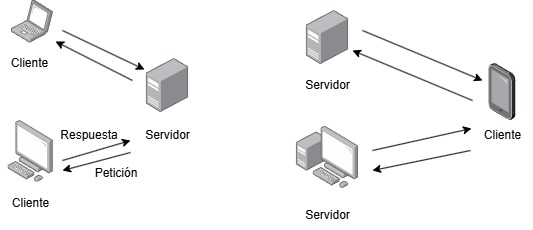
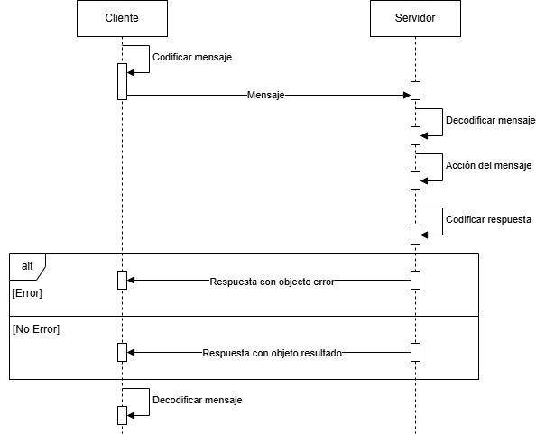
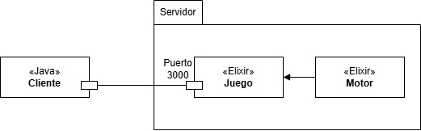

# Práctica 1

| Documento: | Módulo-1: Arquitectura cliente-servidor                                                              |
| ---------- | ---------------------------------------------------------------------------------------------------- |
| Curso:     | SISTEMAS DISTRIBUIDOS - Grado en Ingeniería Informática                                              |
| Libro:     | Enunciado 1: Introducción a los sistemas distribuidos. Arquitectura de distribución cliente-servidor |
| Autor:     | SAYALERO BLAZQUEZ, ALONSO                                                                            |
| Fecha:     | Viernes, 21 de Noviembre de 2025                                                                     |
| Versión:   | 1.0                                                                                                  |

## Tabla de contenidos


- [Práctica 1](#práctica-1)
  - [Tabla de contenidos](#tabla-de-contenidos)
  - [Objetivo](#objetivo)
  - [La arquitectura de distribución cliente-servidor](#la-arquitectura-de-distribución-cliente-servidor)
  - [JSON-RPC](#json-rpc)
      - [Sintáxis de JSON-RPC](#sintáxis-de-json-rpc)
        - [Petición](#petición)
        - [Respuesta](#respuesta)
  - [Poner la teoría en práctica](#poner-la-teoría-en-práctica)
    - [El servidor Elixir](#el-servidor-elixir)
          - [Arquitectura del servidor](#arquitectura-del-servidor)
    - [El cliente Java](#el-cliente-java)
      - [Petición con parámetros](#petición-con-parámetros)
      - [La función "printServerResult"](#la-función-printserverresult)
    - [Ahora es tu turno](#ahora-es-tu-turno)
          - [Tabla de primitivas](#tabla-de-primitivas)

## Objetivo

Al finalizar esta práctica sabremos los fundamentos de la comunicación entre un cliente y un servidor, así como una idea del protocolo JSON-RPC. Con todos estos
fundamentos programaremos un cliente en Java que nos va a permitir jugar a un juego distribuido.

## La arquitectura de distribución cliente-servidor

En el contexto de los sistemas distribuidos, un sistema construido en base a una arquitectura cliente-servidor consta de dos elementos, bien nombrados en el propio nombre
de la arquitectura, el cliente y el servidor. Hay que tener en cuenta que esto abarca cualquier multiplicidad de los elementos, un sistema con arquitectura cliente-servidor
puede estar formado por un cliente y un servidor o dos clientes y un servidor o un cliente y tres servidores, y así con todas las combinaciones posibles dependiendo de las
necesidades globales del sistema.

El servidor es la máquina o máquinas físicas o virtuales cuyo trabajo es recibir peticiones a través de un punto de acceso. La comunicación con el punto de acceso
proporcionado por el servidor se realiza mediante uno o varios protocolos de transporte, los más conocidos son TCP (sobre el que se construye HTTP) y UDP.

Todo servidor implementa un servicio, al cuál acceden los clientes mediante una interfaz que presenta el servidor satisfaciendo la función del servicio mediante
funciones accesibles de diferentes formas (RPC, RMI, primitivas...).

Al igual que el servidor el cliente puede ser también una máquina física o virtual o varias de ellas. Su trabajo es realizar peticiones al servidor que provocan
una respuesta del mismo, estas respuestas pueden incluir una gran variedad de tipos, entre ellos respuestas de éxito, de rechazo o de error.



La imagen superior muestra un par de ejemplos de arquitecturas distribuidas cliente-servidor. Se puede observar como tanto los clientes como los servidores pueden
ser cualquier tipo de dispositivo con las capacidad necesarias.

El patrón cliente-servidor se basa en el patrón de interacción petición-respuesta (R-R del inglés _request_-_response_). Dicho patrón puede ser síncrono o asíncrono,
aunque, durante las prácticas, todo se desarrolla siguiendo el patrón R-R síncrono.

## JSON-RPC

JSON-RPC es un protocolo de llamada de procedimientos remotos (RPC, remote procedure call). Normalmente los protocolos que implementan RPC utilizan estructuras de datos
codificadas de manera que la salida de las mismas son binarios no legibles para el ser humano. JSON-RPC trata evita esto empleando la estructura de JSON como método de
codificación para los mensajes entre cliente y servidor.

Durante esta y las siguientes lecciones estaremos trabajando con peticiones por parte del cliente y respuestas por parte del servidor.
El estándar del protocolo define como debe ser la estructura de los objetos petición y respuesta con los que trabajaremos.

Ambos objetos constan de un campo de versión, necesario en este caso ya que estaremos trabajando con la versión 2 de este protocolo.

#### Sintáxis de JSON-RPC

##### Petición

El objeto petición implementa una petición al servidor en una estructura JSON con el formato estándar de JSON-RPC.
Consta de un campo método (method) obligatorio en el que se indica el método que se quiere invocar en el servidor, un campo parámetros (params) opcional
en el que se pasan elementos necesarios para el método invocado, el equivalente a los parámetros de una función en programación, y un campo identificador (id) el cual
nosotros tomaremos como obligatorio y que, también en nuestro caso, será un `string` de caracteres.

```json
{
  "version": "2.0",
  "method": "travel",
  "params": {
    "location": "madrid",
    "days": 3
  },
  "id": "100"
}
```

##### Respuesta

El objeto respuesta implementa la respuesta que envía el servidor al cliente una vez la petición ha concluido, al ser un servidor síncrono siempre obtendremos una
respuesta. Consta de un campo resultado (result) si la petición ha sido correcta o, si la petición es incorrecta, un campo error con los motivos del mismo.
Además devuelve el mismo identificador (id) que había recibido del objeto petición.

```json
{
  "version": "2.0",
  "result": "has viajado 3 dias a madrid",
  "id": "100"
}
```

Si la respuesta es errónea, el objeto respuesta tendrá la siguiente estructura:

```json
{
  "version": "2.0",
  "error": {
    "code": -32600,
    "message": "algo salio mal en el servidor"
  },
  "id": "100"
}
```

Para profundizar sobre lo que se ha resumido arriba la especificación del mismo es corta y asequible y se puede encontrar en el siguiente enlace:
https://www.jsonrpc.org/specification (inglés).

Para saber más sobre JSON en el siguiente enlace se encuentra la especificación del mismo: https://www.json.org/json-es.html.

Sobre RPC la página de wikipedia en inglés da una buena descripción del mismo: https://en.wikipedia.org/wiki/Remote_procedure_call (inglés).

## Poner la teoría en práctica

Con todo lo aprendido anteriormente podemos deducir que la interacción entre el cliente y el servidor sigue la premisa del diagrama de secuencia que se muestra
a continuación.



Una vez entendidos los conceptos vamos a ponerlos en práctica. Durante las siguientes prácticas vamos a pasarnos un juego escrito en Elixir y que va a actuar como servidor
(o servidores como veremos en prácticas posteriores) con el que nos comunicaremos mediantes clientes de Java.

### El servidor Elixir

Lo que llamamos servidor en realidad es la combinación de dos sistemas, un motor de juego que contiene toda la lógica de las partes que componen un juego y el juego, que
es el servidor con el que nos comunicaremos durante las prácticas que lo requieran.

El servidor es un sistema multienhebrado, es decir, permite múltiples conexiones al mismo tiempo, cuenta con un sistema de autenticación para los usuarios, que nosotros
emplearemos para iniciar nuestros personajes, y maneja como cambia el estado del juego.

###### Arquitectura del servidor



### El cliente Java

Sabiendo que el servidor acepta peticiones TCP/IP y que funciona mediante el protocolo JSON-RPC podemos hacer un cliente en Java que se conecte al puerto 3000
por el que está escuchando el juego y lanzar una petición para saber todos los métodos que acepta el servidor.

```java
public class JavaClient {
  public static void main(String[] args) throws IOException {
    Gson jsonParser = new Gson();
    Socket socket = new Socket("localhost", 3000);

    // Abrir el canal de comunicación con el servidor
    PrintWriter out = new PrintWriter(socket.getOutputStream(), true);
    BufferedReader in = new BufferedReader(new InputStreamReader(socket.getInputStream()));

    // Preparar los datos
    HashMap<String, Object> mapa = new HashMap<String, Object>();
    mapa.put("jsonrpc", "2.0");
    mapa.put("method", "info");
    mapa.put("id", "1");

    // Enviar datos
    out.println(jsonParser.toJson(mapa));

    // Obtener respuesta
    HashMap<String, Object> respuesta = jsonParser.fromJson(in.readLine(), new TypeToken<HashMap<String, Object>>() {}.getType());

    printServerResult(respuesta); // Imprimir respuesta
    socket.close(); // Cerrar el canal
  }

  private static void printServerResult(HashMap<String, Object> mapa) {
    Object resultado = mapa.get("result");
    Object error = mapa.get("error");
    Object id = mapa.get("id");

    if (resultado == null) {
      if (error == null) {
        System.out.println("Algo salio mal en el servidor \n");
      } else {
        System.out.println("Error al realizar la accion del mensaje con id " + id + ": " + error + "\n");
      }
    } else {
      System.out.println("Resultado del mensaje con id " + id + ": " + resultado + "\n");
    }
  }
}
```

Vamos a profundizar en lo que estamos haciendo en el código de arriba.

En primer lugar creamos un parser para transformar mapas de Java en JSON y viceversa. Su función es serializar/deserializar los mensajes enviados por red.

```java
Gson jsonParser = new Gson();
```

A continuación creamos un socket que nos conecta con el servidor mediante el puerto 3000 y también inicializamos el escritor y el lector del socket.
El escritor nos permite mandar la petición al juego mientras que el lector atrapa la respuesta que este nos dé.

```java
Socket socket = new Socket("localhost", 3000);

PrintWriter out = new PrintWriter(socket.getOutputStream(), true);
BufferedReader in = new BufferedReader(new InputStreamReader(socket.getInputStream()));
```

Una vez tenemos el socket conectado el siguiente paso natural es realizar la petición, para ello tenemos que contruirla en un mapa de Java y
dárselo al parser de JSON para que nos lo transforme y lo podamos enviar.

```java
HashMap<String, Object> mapa = new HashMap<String, Object>();
mapa.put("jsonrpc", "2.0");
mapa.put("method", "info");
mapa.put("id", "1");

out.println(jsonParser.toJson(mapa));
```

Por último, obtenemos la respuesta del servidor, la imprimimos en consola y cerramos el socket.

```java
HashMap<String, Object> respuesta = jsonParser.fromJson(in.readLine(), new TypeToken<HashMap<String, Object>>() {}.getType());

printServerResult(respuesta);
socket.close();
```

#### Petición con parámetros

Si queremos mandar parámetros al juego como parte de la petición simplemente habría que incluir el campo en el mapa de Java que hemos creado para la petición.

```java
// Petición anterior
HashMap<String, Object> mapa = new HashMap<String, Object>();
mapa.put("jsonrpc", "2.0");
mapa.put("method", "info");
mapa.put("id", "1");

// HashMap de parámetros que queremos enviar
HashMap<String, String> params = new HashMap<String, String>();
params.put("about", "character");

// Añadimos los parámetros a la petición
mapa.put("params", params);
```

El resto de programa es idéntico al cliente mostrado antes. Hay que tener en cuenta que la petición mostrada en este ejemplo falla si se ejecuta contra el juego.
Es un simple ejemplo de como se añadirían parámetros a una petición que los requiera.

#### La función "printServerResult"

Esta función formatea el resultado que llega desde el servidor, comprobando si ha sido correcta o no. Siguiendo el estándar de JSON-RPC podemos darnos cuenta de
que hay dos posibilidades:

1. Que el objeto traiga un campo resultado
2. que traiga un campo error.

Teniendo en cuenta esto el formateador simplemente extraerá ambos campos y comprobará si hay un resultado, en caso que no halla, la petición JSON habrá fallado y
el campo error tendrá el motivo del mismo.

Se proporciona esta función para que pueda ser reutilizada por cualquier cliente que sea necesario crear.

### Ahora es tu turno

Para solidificar los conocimientos que hemos adquirido y que vamos a ir adquiriendo a lo largo de las siguientes prácticas vamos a jugar al ya mencionado juego.

Como ya sabemos, nos vamos a comunicar con el juego mediante clientes de Java, ya que este actúa como un servidor. Mediante el cliente de Java mandaremos primitivas
al juego en formato JSON mediante JSON-RPC para que este modifique el estado del juego de acuerdo a nuestra acciones. Para esta práctica es necesario saber que
contamos con un personaje, llamado Tim, este se mueve por un mundo formado por habitaciones conectadas mediante conexiones, dentro de las habitaciones podemos encontrar
NPCs, objetos o enemigos. Todos estos elementos tienen un nombre que emplearemos para referirnos a ellos en los parámetros de la petición si es necesario.


Sabiendo cómo se crea un cliente para comunicarnos con el juego, como mandar peticiones con y sin parámetros y qué hace el juego cuando enviamos los mensajes vamos a
ponerlo en práctica. Empleando las primitivas de la tabla utiliza los métodos necesarios para encontrar y equiparte una espada. Una vez equipada la espada viaja a la
ubicación `habitacion_cueva_3`. Dejaremos esta práctica cuando lleguemos a la localización.

Para poder jugar necesitamos escoger un personaje mediante la utilidad "login" de "Utilities.java". Durante estas prácticas vamos a jugar como Tim.

###### Tabla de primitivas

| Primitiva                | Respuesta / Acción              | Parámetros                  | Explicación parámetro                           |
| ------------------------ | ------------------------------- | --------------------------- | ----------------------------------------------- |
| inspect_current_location | estado de la ubicación actual   | character_name              | nombre del personaje con el que estamos jugando |
| cross_connection         | cambia de estancia al personaje | connection / character_name | nombre de la conexión / nombre del personaje    |
| take_object              | recoge un objeto de la estancia | object / character_name     | nombre del objeto / nombre del personaje        |
| equip_object             | equipa el objeto al personaje   | object / character_name     | nombre del objeto / nombre del personaje        |
| inspect_character        | estado del personaje            | character_name              | nombre del personaje                            |